# SocialMediaEngagement-Analytics

**SocialMediaEngagement-Analytics** is an SQL-based project designed to analyze user engagement, content performance, and social media behavior. The project uses MySQL queries to extract key insights from social media data, helping to understand how users interact with content, popular hashtags, and more.

## Tool Used

 &nbsp;

## Motivation

In the fast-paced world of social media, understanding user engagement and content performance is crucial for anyone looking to optimize their online presence. Whether you're a content creator, marketer, or business, having actionable insights into what drives user interaction can significantly influence strategy and decision-making.

This project was developed with the goal of analyzing user behavior and content engagement on social media platforms. By exploring trends such as the most liked and commented posts, popular hashtags, and active users, the project provides a comprehensive look at how users interact with content. With these insights, individuals and businesses can better tailor their content to meet the interests and preferences of their audience.

## Components

- [Queries](https://github.com/F7-bit/SocialMediaEngagement-Analytics/blob/main/Queries.sql)
- [ER Diagram](https://github.com/F7-bit/SocialMediaEngagement-Analytics/blob/main/ER_diagram.png)

## Key goals of the project include:
- Identifying top-performing content to guide content creation strategies.
- Recognizing highly engaged users to better understand your audience.
- Uncovering trends in hashtag usage for targeted content marketing.
- Gaining insights into user behavior patterns to improve engagement.

## Key Features / Queries

### **1. Engagement Analysis**

- **Most Liked Post**: Identifies the post with the highest number of likes.
  
   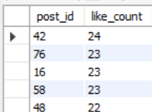
  
- **Top Users by Likes Received**: Ranks users based on total likes received on their posts.
  
   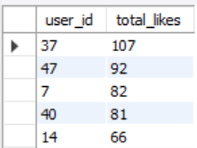
  
- **Most Commented Posts**: Finds posts with the highest number of comments.
  
   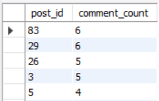
  
- **Users with Most Comments on Their Posts**: Highlights users whose posts have received the most comments.
  
   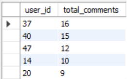
  
- **Most Liked and Commented Posts**: Combines likes and comments to identify the most engaging posts.
  
   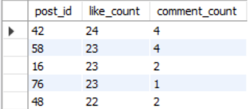
  
- **Users with Most Likes Given**: Identifies users who have liked the most posts.
  
   

### **2. User Activity Analysis**

- **Most Active Users (by Number of Posts)**: Identifies users who contribute the most content.
  
   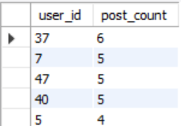
  
- **Users with Most Followers**: Ranks users based on their total number of followers.
  
   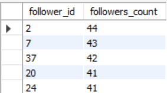
   
- **Users Who Follow Others Most**: Identifies users who follow the highest number of others.
  
   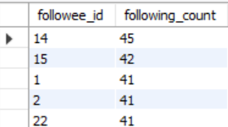
  
- **Users Who Commented the Most**: Highlights users with the most comments on posts.
  
   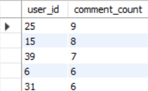
  
- **Users Who Logged in Multiple Times**: Tracks users with multiple logins.
  
   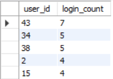
  
- **Users with Most Mutual Follows**: Analyzes mutual follow relationships.
  
   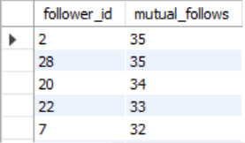

### **3. Content Analysis**

- **Most Liked Photo Post**: Identifies the most liked photo post.
  
   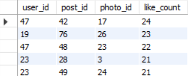
   
- **Most Liked Video Post**: Identifies the most liked video post.
  
   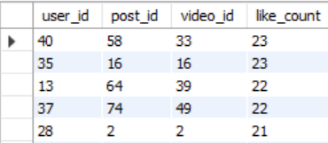

- **Content Types (Photos vs Videos) with Higher Likes**: Compares likes between photo and video posts.
  
   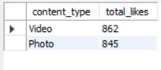

### **4. Hashtag and Trend Analysis**

- **Most Popular Hashtags**: Identifies the most used hashtags and their frequency.
  
   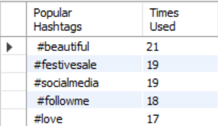
   
- **Posts with Specific Hashtags**: Analyzes posts containing specific hashtags.
  
   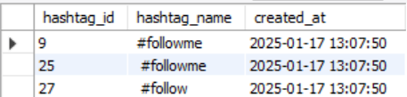
   
- **Hashtags Used Together Most Often**: Identifies pairs of hashtags that are used together frequently.
  
   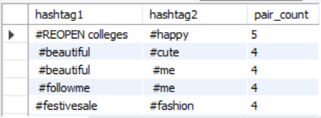
  
- **Users Posting the Most Unique Hashtags**: Highlights users posting the most unique hashtags.
  
   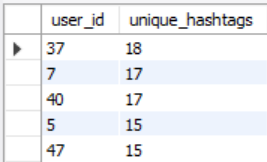

### **5. User Behavior Trends**

- **Users Who Only Like Photos (No Comments)**: Identifies users who only like photo posts without commenting.
  
   

- **Users Posting Only Videos**: Identifies users who only post videos.
  
   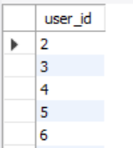
   
- **Users Posting Only Photos**: Identifies users who only post photos.
  
   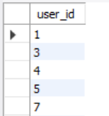

- **Logins from Multiple IPs for a Single User**: Tracks users logging in from different IPs.
  
   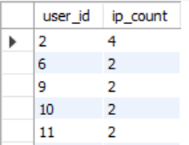

### **6. Location and Caption Analysis**

- **Most Popular Locations**: Identifies the most popular locations where posts are made.
  
   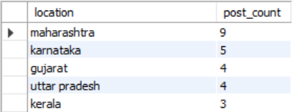

- **Average Caption Length per User**: Analyzes the average caption length for each user.
  
   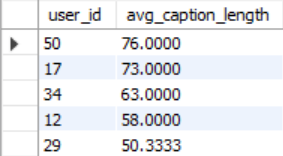
  
- **Captions Containing Specific Words**: Finds captions containing certain words like 'love' or 'life'.
  
   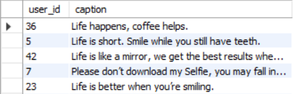

- **Captions by Length Category**: Categorizes captions by their length (short, medium, long).
  
   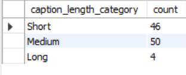

## Insights

The **SocialMediaEngage-Analytics** project provides several valuable insights, including:

- **Content Engagement**: By identifying the most liked and commented posts, we can uncover which types of content resonate the most with the audience. This is useful for tailoring future posts to generate higher engagement.
  
- **User Behavior**: The project allows for the identification of users who contribute the most through likes, comments, and posts. It also highlights users who are highly engaged with the platform, whether through following others or interacting with content. These insights help in identifying brand advocates or influencers.
  
- **Hashtag Performance**: Analyzing popular hashtags and hashtags used together most frequently offers insight into trending topics and how they are associated with particular content. It also provides a view into the relevance of specific hashtags to user behavior and content types.
  
- **Content Preference**: Insights into whether users prefer photo posts or video posts can inform future content strategies. Knowing whether video or photo content gets more engagement helps content creators optimize their content formats.
  
- **User Trends**: By tracking user actions like login frequency, comment behavior, and login from multiple IPs, the project helps identify potential spammers or bots, as well as loyal, repeat users.

- **Geographical Insights**: The analysis of popular post locations reveals geographical trends, which could assist in region-specific campaigns or localization strategies.

